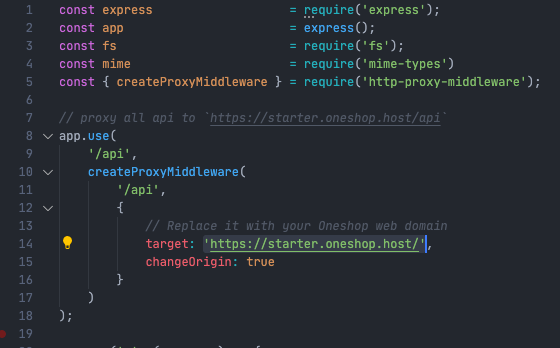
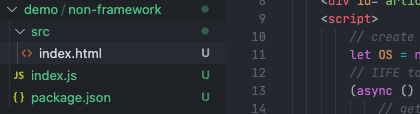

# ONESHOP WEB SDK
Web framework for accessing Oneshop API conveniently.

[](https://www.npmjs.org/package/oneshop.web)
[](https://www.npmjs.com/package/oneshop.web)
[](https://runkit.com/npm/oneshop.web)

The Oneshop Web library provides convenient access to Oneshop Web APIs.

## Documentation

See the [`Oneshop-web` API docs](https://docs.oneshop.dev) for JS/ReactJS.
<br/><br/>

## Guildlines
### Create shop
[`https://youtu.be/YjEhv97633Y`](https://youtu.be/YjEhv97633Y)

### Setup custom theme
[`https://youtu.be/CPEyCSblJb4`](https://youtu.be/CPEyCSblJb4)

### Develop your own theme
[`https://youtu.be/ej2FloWjxNQ`](https://youtu.be/ej2FloWjxNQ)<br/><br/>

  
## Installation

### Option 1. For framworks like React JS, Vue Js or Angular JS.

Install with `yarn`:

```
yarn add oneshop.web
```

OR with `npm`:

```
npm install --save oneshop.web
```
<hr/>

### Option 2. Develop without using frameworks<br/>
See the demo folder in this repository. Start an Express server and set the proxy target to your web shop's domain.<br/><br/>

1. install node modules before you start the server.
```
cd ~/demo/non-framework 
npm i
```
2. Replace the Oneshop's default theme domain with yours.<br/>

3. Edit your source files at `src` folder, you are ready to develop your website now!🎉 <br/>

<br/>

## Usage

### ReactJS

```js
import React from 'react';
import Oneshop from 'oneshop.web';
const OS = new Oneshop();

function App(){

    // get article hooks and init articles = [];
    const {articles, setArticles} = useState([]);

    // get articles
    OS.article.get().then(setArticles).catch(alert);

    return (
        <div className="articles">
            {articles.map(a => (
                <div id={a.id}>
                    {a.sections.map((s, section_idx) => (
                        <div id={`section-${a.id}-${section_idx}`} className="section">
                            
                            <h3>{s.title}</h3>
                            <p>{s.description}<p>
                        </div>
                    ))}
                </div>
            ))}
        </div>
    );
}

```

### Without frameworks
```html
<!DOCTYPE html>
<html>
  <head>
    <meta charset="utf-8"/>
    <script id="oneshop-web" src="https://cdn.oneshop.cloud/oneshop-sdk-min.js"></script>
  </head>
  <body>
    <div id="articles"></div>
    <script>
        // create OS instance
        let OS = new Oneshop.default();
        // IIFE to get article
        (async () => {
            // get articles
            let articles = await OS.article.get();
            // get element
            let articleDiv = document.getElementById('articles');
            // get view
            articleDiv.innerHTML = articles.map(a => `
              <div>
                ${a.sections[0].media.length > 0 ? `` : ""}
                <h5>${a.sections[0].title}</h5>
                <p>${a.sections[0].description}</p>
              </div>
            `);
        })();
    </script>
  </body>
</html>
```
<br/><br/>
## Equiry?
Developers are eligible to request a referral code from us to use the service for free!<br/>
Please email to: [`support@oneshop.team`](mailto:support@oneshop.team) for details 🎉
